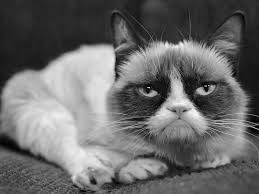
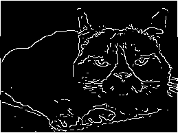
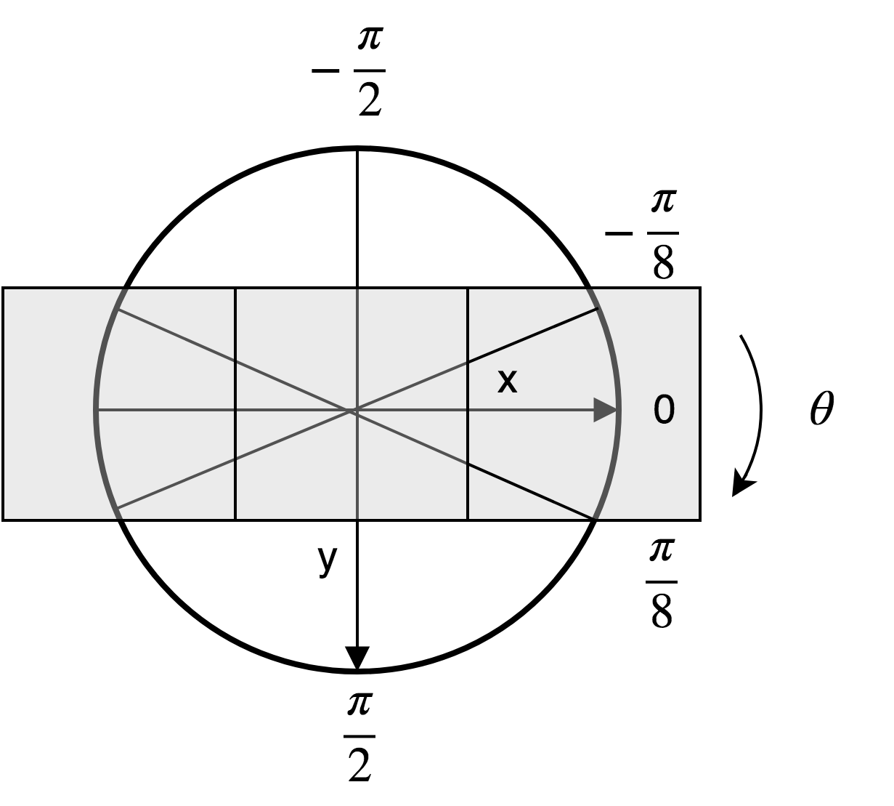

# Travaux pratiques : séance 3

Détection de contours : filtre de Canny.
**Ce TP sera évalué.**

## Filtre de Canny

Le filtre de Canny est un détecteur de contours développé en 1986 par John Canny.
La fonction `Canny` d'OpenCV implémente ce filtre, et une description est donnée ici : `https://docs.opencv.org/3.4.15/d7/de1/tutorial_js_canny.html`.
L'objectif de ce TP est d'implémenter le filtre de Canny puis de le comparer avec l'implémentation d'OpenCV.
Chaque étape du filtre est à coder dans une fonction séparée.






## Étapes

La méthode de détection des contours par le filtre de Canny se compose de cinq étapes :

1. Réduction du bruit par un filtre gaussien d'écart-type $`\sigma`$
2. Estimation du gradient de l'image avec les masques de Sobel : calcul de la magnitude et de la direction du gradient.
3. Suppression, dans l'image de magnitude du gradient, des points qui ne sont pas des maxima locaux dans la direction du gradient.
4. Calcul des seuils haut et bas dans l'image de magnitude du gradient.
5. Seuillage par hystérèse  en utilisant les seuils haut et bas calculés précédemment : les points dont la valeur est supérieure au seuil haut sont inclus dans le résultat ; les points dont la valeur est comprise entre le seuil haut et le seuil bas sont inclus dans le résultat si et seulement si ils sont connectés à un point dont la valeur est supérieure au seuil bas.

Le filtre prend en entrée une image (on se limitera aux images en niveaux de gris) et donne en sortie une image binaire (0 : absence de contour, 255 : présence d'un contour).

### 1. Réduction du bruit

Cette étape filtre l'image d'entrée par convolution avec un filtre gaussien dont l'écart-type est passé en paramètre.
Écrire une fonction  `gaussianFiltering(f)` qui applique sur l'image $`f`$ un filtre gaussien d'écart-type $`\sigma`$.
Cette fonction retourne une image à valeurs réelles.

### 2. Gradient de l'image

Cette étape calcule deux images : la magnitude et la direction du vecteur gradient.
Le vecteur gradient sera estimé par convolution avec les filtres de Sobel dans les directions horizontales et verticales.
Le filtre $`S_x`$ estime les variations horizontales, le filtre $`S_y`$ les variations verticales :

$`S_x= 
\begin{bmatrix}
-1&0&1\\
-2&0&2\\
-1&0&1
\end{bmatrix},
S_y=\begin{bmatrix}
-1&-2&-1\\
0&0&0\\
1&2&1
\end{bmatrix}`$

Dans ce but écrire les fonctions  `computeGx(f)` et `computeGy(f)`
qui calculent et retournent les  images $`G_x=I \ast S_x`$ et $`G_y=I \ast S_y`$.

À partir de ces deux images, la magnitude du vecteur gradient se calcule en chaque point avec :

$`M(x) = \sqrt{(G_x(x)) ^2 + (G_y(x))^2}`$ 

et la direction du vecteur gradient avec :

$`\Theta(x)=\arctan (\frac{G_y(x)}{G_x(x)})`$

Pour calculer $`\arctan(\frac{y}{x})`$, utiliser la fonction `atan2(y,x)`.
Cette fonction retourne l'angle formé par le vecteur $`(x,y)`$ et l'axe x dans l'intervalle $`[-\pi,\pi]`$.

Écrire les fonctions :

`def computeMagnitude(Gx,Gy):` et `def computeDirection(Gx,Gy):`
qui calculent et retournent $`M(x)`$ et $`\Theta(x)`$.


### 3. Suppression des non-maxima du gradient

Cette étape supprime dans l'image $`M`$ tous les points qui ne sont pas des maxima dans la direction du gradient.
Le but est  « d'amincir » les contours de l'image gradient.

Pour chaque point x de $`M`$, les deux points voisins de x dans la direction du gradient sont examinés. Si x n'est pas un maximum local (sa valeur est inférieure à l'une des deux valeurs des points voisins), la valeur du point x est annulée (mise à 0 dans l'image résultante), sinon sa valeur est conservée.

Les directions du gradient dans l'image $`\Theta(x)`$ sont quantifiées selon quatre orientations.

Tout d'abord on ramène $`\Theta(x)`$ dans l'intervalle $`[-\frac{\pi}{8},\frac{7\pi}{8}[`$ :

- si $`\Theta(x)<-\frac{\pi}{8}`$ on ajoute $`\pi`$  à  $`\Theta(x)`$
- si $`\Theta(x)\geq \frac{7\pi}{8}`$ on soustrait $`\pi`$  à  $`\Theta(x)`$

Ensuite :

- si $`-\frac{\pi}{8}\leq \Theta(x) < \frac{\pi}{8}`$ l'orientation du gradient est horizontale : on examine les deux voisins de gauche et de droite
- si $`\frac{\pi}{8}\leq \Theta(x) < \frac{3\pi}{8}`$ l'orientation du gradient est diagonale : on examine les voisins en bas à droite et en haut à gauche
- si $`\frac{3\pi}{8}\leq \Theta(x) < \frac{5\pi}{8}`$ l'orientation du gradient est verticale : on examine les deux voisins en haut et en bas
- si $`\frac{5\pi}{8}\leq \Theta(x) < \frac{7\pi}{8}`$ l'orientation du gradient est diagonale : on examine les voisins en bas à gauche et en haut à droite 

Penser à tester que les points voisins sont à l'intérieur de l'image.

L'axe des y pointe vers le bas et l'angle augmente dans le sens horaire.



Exemple : pour un angle compris entre $`-\frac{\pi}{8}`$ et $`\frac{\pi}{8}`$ on considère que l'orientation est horizontale : on examine donc les voisins de droite et de gauche.

Écrire la fonction `def removeNonMaxima(grad_m, grad_d):`
qui retourne l'image $`G_{max}`$ résultante de cette opération.


### 4. Calcul des seuils

Deux valeurs de seuil (un seuil haut et un seuil bas) sont calculés sur l'image  $`G_{max}`$.
Le seuil haut est déterminé en fonction d'un paramètre $`\alpha`$ qui détermine le pourcentage des points qui seront inférieurs à ce seuil dans l'image.
Exemple : avec $`\alpha=0.9`$, le seuil haut $`t_{high}`$ sera déterminé de manière à ce que 90% des points de l'image aient une valeur inférieure à $`t_{high}`$.

En pratique, déterminer $`t_{high}`$ revient à trier les valeurs de $`G_{max}`$  par ordre croissant dans un tableau $`t`$  et à examiner la valeur de $`t[round(\alpha*n)]`$ où $`n`$ est le nombre de valeurs de l'image.

Ensuite on calcule $`t_{low}=\beta * t_{high}`$


Écrire la fonction :

```python
def computeThresholds(grad_maxima,  alpha,  beta):
```

Cette fonction calcule et retourne `tHigh`et `&tLow`, les valeurs des seuils haut et bas calculés à partir de l'image de magnitude de gradient et des paramètres `alpha` et `beta`. 


### 5. Seuillage par hystérèse

Cette étape finale consiste à conserver les points de contour qui vérifient un certain critère.

Les points dont la valeur est inférieure à $`t_{low}`$ ne sont pas inclus dans le résultat.
Les points dont la valeur est supérieure à $`t_{high}`$ sont conservés dans le résultat. Ils agissent comme des « graines » dans un algorithme de croissance de régions. 
Pour chaque point $`p`$ tel que $`G_{max}(p) \geq t_{high}`$, on lance une propagation à partir de ce point $`p`$ de manière à ce que tous les voisins de $`p`$ tels que $`G_{max}(p)\geq t_{low}`$ soient inclus dans le résultat, ainsi que tous les voisins des voisins de $`p`$ qui vérifient ce critère, etc.
On appelle ce procédé de seuillage qui utilise un seuil haut et un seuil bas un seuillage par *hystérèse*.

En pratique on va utiliser une file FIFO.
Les opérations sont : 
- `p=fifo.front()` récupère le premier point de la liste
- `fifo.pop()` supprime le premier point de la liste
- `fifo.push(p)` ajoute le point p à la fin de la liste
- `fifo.empty()` retourne `true` si la file est vide

Le pseudo-code du seuillage par hystérèse est le suivant :

```code
// initialisation de la file et du résultat
pour tous les points p de grad_maxima:
    si grad_maxima(p) >= tHigh
        fifo.push(p)
        canny(p)=255
    sinon :
        canny(p)=0

tant que !fifo.empty() // la file n'est pas vide
    p=fifo.front()     
    fifo.pop()
    pour tous les 8 voisins q de p:
        si q est à l'intérieur de l'image et
        grad_maxima(q)>=tLow et canny(q)=0: 
            canny(q)=255         // q est inclus dans le résultat
            fifo.push(q)            // on ajoute q dans la file


```

Écrire la fonction :

```python
def hysteresisThresholding(grad_maxima, tLow,tHigh):
```

qui retourne l'image binaire du résultat du filtre de Canny.


## Programme 

Le programme complet prend en paramètres :

- le nom de l'image d'entrée 
- la valeur $`\sigma`$ du filtre gaussien
- la valeur $`\alpha`$ pour le calcul du seuil haut
- la valeur $`\beta`$ pour le calcul du seuil bas

et écrit les images suivantes :

- le résultat du filtre gaussien d'écart-type $`\sigma`$
- la magnitude du gradient
- le résultat final du filtre de Canny

Le programme affiche dans une fenêtre OpenCV le résultat du filtre de Canny et sur la sortie standard les deux seuils calculés par la fonction `computeThresholds`.

### Tests

* Tester votre programme sur l'image `grumpy.pgm` avec les paramètres suivants : $`\sigma=2, \alpha=0.95, \beta=0.8`$
* Comparer le résultat avec la fonction `cv2.Canny` d'OpenCV en utilisant les mêmes paramètres (les paramètres ne sont pas tout à fait les mêmes, trouver un moyen de rendre les résultats comparables)

### Interface graphique

Ajouter trois trackbars permettant de modifier interactivement l'écart-type $`\sigma`$  du filtre gaussien ainsi que les seuils haut et bas et permettant de visualiser le résultat correspondant du filtre de Canny.

On veut pouvoir comparer visuellement le résultat obtenu par votre méthode et par la méthode `Canny` d'OpenCV.

