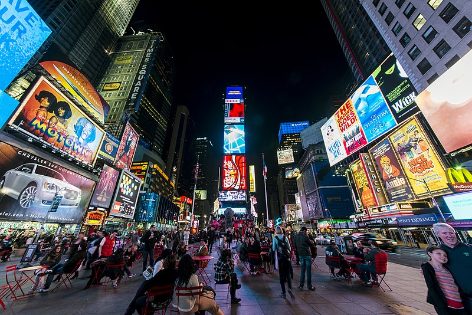

# Travaux pratiques : séance 4

Transformations géométriques en OpenCV.

## Exercice 1 : translation

En vous appuyant sur la bibliothèque OpenCV, écrire un programme Python qui applique à une image une translation par un vecteur $`\mathbf v(x,y)`$  avec  le nom de l'image, `x`  et `y` passés en paramètre.

## Exercice 2 : rotation

### Version 1

En vous appuyant sur OpenCV, écrire un programme Python qui applique à une image une rotation d'angle et de centre passés en paramètre. 
Ajouter ensuite une trackbar permettant de modifier l'angle de rotation interactivement.

### Version 2

Dans cette version, l'objectif est d'implémenter le calcul de la rotation dans une fonction Python, sans s'appuyer sur une fonction OpenCV.
Vous comparerez deux implémentations :

* Une première implémentation qui parcourt l'image source afin de calculer l'image de destination ;
* Une seconde implémentation qui parcourt l'image de destination afin de calculer la valeur correspondante de chaque pixel dans l'image source.

Conclusion ?

## Exercice 3 : transformation affine

Une transformation affine possède six degrés de liberté. C'est une transformation qui combine rotation, translation et mise à l'échelle (homothétie). Trois couples de points permettent donc de définir une transformation affine.
On souhaite appliquer une transformation affine à une image passée en paramètre. Cette transformation sera paramétrée par trois points de contrôle définis interactivement par l'utilisateur.

## Exercice 4 : transformation projective

Une transformation projective, aussi appelée homographie, possède huit degrés de liberté. Quatre couples de points permettent donc de définir une telle transformation.

### Programme 1

Reprendre l'exercice 3 et l'adapter à la transformation projective : 4 points de contrôle seront donc nécessaires.

### Programme 2

En vous appuyant sur OpenCV, écrire un programme qui permet de remplacer l'affiche "Motown" dans l'image ci-dessous par l'image de votre choix (passée en paramètres). Vous pourrez définir manuellement les quatre points de contrôle sur l'image.

