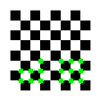

# Rapport du TP5 sur les points d'intérêts

## Descripteur Harris

### Robustesse à la rotation
En faisant varier l'angle de rotation, on se rend compte que le descripteur Harris est invariant à la rotation, mise à part les points détectés qui sortent de l'image et ceux qui deviennent détectés pour certains angles.

### Robustesse à la mise à l'échelle
Le descripteur Harris n'est pas solide concernant les changements d'échelles. En effet, si un pixel forme un coin à 50% de l'image de base, alors plusieurs coins seront détectés à 150% par exemple.

C'est bien ce que j'ai pu remarquer lors de mes tests : 

On voit par exemple que un des côtés du triangle rectangle se remplit de point d'intérêts en grandissant, de même pour la tête de flèche.

## Descripteur My Harris

### Robustesse à la rotation

### Robustesse à la mise à l'échelle

### Robustesse au bruit

## Descripteur Shi-Tomasi

### Robustesse à la rotation
Tout comme Harris, Shi-Tomasi est invariant à la rotation : 

### Robustesse à la mise à l'échelle
De la même manière, Shi-Tomasi n'est pas invariant à l'échelle, on voit nettement la différence entre la première image à 50% et les deux suivantes à 100/150% :

### Robustesse au bruit

### Robustesse à la transformation projective

## Descripteur SIFT

### Robustesse à la rotation
SIFT attribue à chaque point-clé une ou plusieurs orientations déterminées localement sur l'image à partir de la direction des gradients dans un voisinage autour du point. De ce fait, SIFT est invariant à la rotation.

### Robustesse à la mise à l'échelle
Comme l'indique son nom, le descripteur Scale-Invariant Features Transform est invariant à l'échelle car pour chaque point clé, le calcul s'effectue sur le gradient de la pyramide dont le paramètre est le plus proche du facteur d'échelle du point.

### Robustesse au bruit

### Robustesse à la transformation projective

## Descripteur FAST

### Robustesse à la rotation

### Robustesse à la mise à l'échelle

### Robustesse au bruit

## Descripteur SURF

### Robustesse à la rotation

### Robustesse à la mise à l'échelle

### Robustesse au bruit

## Descripteur BRIEF

### Robustesse à la rotation

### Robustesse à la mise à l'échelle

### Robustesse au bruit

## Descripteur ORB

### Robustesse à la rotation

### Robustesse à la mise à l'échelle

### Robustesse au bruit