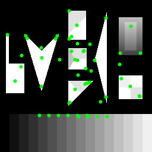
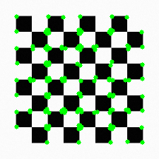

# Rapport du TP5 sur les points d'intérêts

## Descripteur Harris

### Robustesse à la rotation

En faisant varier l'angle de rotation, on se rend compte que le descripteur Harris est invariant à la rotation, mise à part les points détectés qui sortent de l'image et ceux qui deviennent détectés pour certains angles.

### Robustesse à la mise à l'échelle

Le descripteur Harris n'est pas solide concernant les changements d'échelles. En effet, si un pixel forme un coin à 50% de l'image de base, alors plusieurs coins seront détectés à 150% par exemple.

C'est bien ce que j'ai pu remarquer lors de mes tests : 

On voit par exemple que un des côtés du triangle rectangle se remplit de point d'intérêts en grandissant, de même pour la tête de flèche.

## Descripteur My Harris

### Robustesse à la rotation

### Robustesse à la mise à l'échelle

### Robustesse au bruit

## Descripteur Shi-Tomasi

### Robustesse à la rotation

Tout comme Harris, Shi-Tomasi est invariant à la rotation : 

### Robustesse à la mise à l'échelle

De la même manière, Shi-Tomasi n'est pas invariant à l'échelle, on voit nettement la différence entre la première image à 50% et les deux suivantes à 100/150% :

### Robustesse au bruit

En comparant les images pour différentes valeurs de \sigma, on se rend compte que Shi-Tomasi est plutôt robuste au bruit :

Sur d'autres images cependant, on se rend compte que le caractère est beaucoup plus aléatoire, ce qui n'en fait pas une solution viable.

### Robustesse à la transformation projective

On peut voir que les points d'intérêts sont conservées en plus de voir l'ajout de nouveaux.

## Descripteur SIFT

### Robustesse à la rotation

SIFT attribue à chaque point-clé une ou plusieurs orientations déterminées localement sur l'image à partir de la direction des gradients dans un voisinage autour du point. De ce fait, SIFT est invariant à la rotation.

### Robustesse à la mise à l'échelle

Comme l'indique son nom, le descripteur Scale-Invariant Features Transform est invariant à l'échelle car pour chaque point clé, le calcul s'effectue sur le gradient de la pyramide dont le paramètre est le plus proche du facteur d'échelle du point.
Cependant, lors de mes tests, je n'ai pas forcément pu retrouver cette propriété :

### Robustesse au bruit

SIFT est plutôt robuste pour les modifications affines mais le bruit étant aléatoire, le descripteur semble très sensible à cette notion.

### Robustesse à la transformation projective

Avec cette image de base :

En zoomant sur le carré blanc en bas, on obtient ceci : 

Il semble ainsi que SIFT soit plutôt robuste concernant les transformations projectives.

## Descripteur FAST

### Robustesse à la rotation

FAST semble plutôt robuste à la rotation sauf pour la rotation à 180°.

### Robustesse à la mise à l'échelle

FAST à 50% trouve moins de points que à 100/150%.

### Robustesse au bruit

On voit rapidement que FAST est très sensible au bruit.

## Descripteur SURF

Je n'arrive plus à faire fonctionner SURF.create() mais le code est disponible.

## Descripteur BRIEF

Je n'arrive plus à faire fonctionner BRIEF.create() mais le code est disponible.

## Descripteur ORB

### Robustesse à la rotation
ORB, qui correspond à Orientied FAST and Rotated BRIEF m'a l'air, au vu des tests, robuste à la rotation sans pour autant y être invariant.

### Robustesse à la mise à l'échelle
A 50%, on obtient tous les points centrés au centre, là où cela est plus stable entre 100 et 150%.

### Robustesse au bruit

De la même manière que certains autres descripteurs vus plus haut, ORB semble assez stable avec le bruit.

