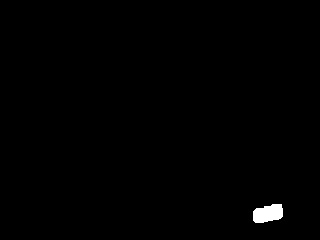

# Rapport du projet de Vision par Ordinateur

## **Sujet choisi**

J'ai choisi le sujet 4, à savoir la soustraction de fond.
Pour cela, je me suis fortement aidé du site Wikipedia, en particulier :
https://en.wikipedia.org/wiki/Foreground_detection

J'ai donc, après avoir testé les fonctions d'OpenCV, tenté d'implémenter ma propre version en commencant naïvement puis en améliorant l'efficacité.
J'ai donc abouti à trois programmes différents, que je présente ci-dessous :
### **En utilisant la méthode OpenCV**

#### **Résultats obtenus**

En utilisant l'algorithme MOG2 :

En utilisant l'algorithme KNN :

#### **Raisonnement**

Aucun raisonnement particulier, j'ai simplement repris et adapté les exemples pour comprendre le fonctionnement.
#### **Problèmes rencontrés**

La ligne `res[mask==255] = frame[mask==255]` est celle qui m'a demandé le plus de temps car je n'avais pas l'habitude jusqu'à maintenant d'utiliser des expressions telles quelles pour les indices mais ce fut l'occasion pour moi de comprendre le fonctionnement derrière.
Outre cela, aucune difficulté particulière n'a été rencontrée.

### **En utilisant le Frame Differencing**

#### **Résultats obtenus**

#### **Raisonnement**

Le principe de cette méthode est de comparer l'image précédente avec l'image courante. En effet, si un pixel affiche un élement statique, sa valeur n'est pas censé changer d'une frame à l'autre. En ajoutant un seuil, on peut contrôler la dûreté de l'algorithme pour ne conserver que les changements assez significatifs à nos yeux.

#### **Problèmes rencontrés**

De même qu'avec la version OpenCV, aucun problème majeur n'a été rencontré.

### **En utilisant Gaussian Average**

#### **Résultats obtenus**

#### **Raisonnement**

Le raisonnement est d'appliquer une fonction gaussienne de densité de probabilité sur les plus récentes images en caractérisant chaque pixel par sa moyenne et sa variance. Une initialisation arbitraire est donc nécessaire pour la première image.
Cependant, l'arrière plan évolue avec le temps (à cause des changements de lumière etc.). C'est pourquoi, à chaque frame, on met à jour la moyenne et la variance pour chaque pixel.
Il faut ensuite trier les pixels selon qu'ils appartiennent au premier plan ou à l'arrière plan selon une valeur arbitraire.

#### **Problèmes rencontrés**

Comme vous pouvez le voir sur le deuxième exemple ci-dessous, l'emplacement des objets dynamiques à la première frame laissent leur trace dans le masque :

Cela est dû à mon initialisation de la moyenne à la première frame.
En effet, cela est dû au fait que l'on fait l'hypothèse que la première frame est l'arrière-plan.

### **Conclusion**
Après comparaison, la version la plus robuste est celle avec les gaussiennes, malgré ce petit soucis en début de traitement qui persiste. Cependant, de nombreuses améliorations sont encore possible. La version Frame Differencing, quant à elle, était trop naïve et atteint très vite ses limites.

# Travaux pratiques : séance 7

Ce TP est évalué et à rendre pour le **13 janvier**. Il fera l'objet d'un rapport au format Markdown (`README.md` dans votre dépôt), qui contiendra un résumé de vos travaux et des illustrations des résultats sous forme de jeux d'essais.
Des démonstrations auront lieu lors de la séance du 13 janvier.

Ce sujet prend la forme d'un mini-projet dont le thème est au choix.

## Sujet 1 : stéréovision

Dans ce sujet on souhaite implémenter un algorithme de calcul de carte de disparité pour une utilisation en stéréovision.
L'objectif est de comparer une implémentation propre avec une implémentation s'appuyant sur OpenCV. Vous pourrez tester vos approches sur des images issues de la base de données https://vision.middlebury.edu/stereo/data/ . Vous pourrez reconstruire la carte 3D et la visualiser avec un logiciel tel que MeshLab https://www.meshlab.net/

## Sujet 2 : redimensionnement liquide

Le redimensionnement liquide ou *seam carving* est une technique de redimensionnement d'image permettant de conserver les éléments perceptuellement importants. 
Un descriptif par les auteurs de cette méthode est disponible ici : https://www.youtube.com/watch?v=6NcIJXTlugc&ab_channel=r3dux
La méthode est décrite ici : https://fr.wikipedia.org/wiki/Seam_carving

L'objectif est d'implémenter l'algorithme de redimensionnement liquide en Python et de le tester sur un ensemble d'images. Une interface graphique permettant de modifier interactivement la taille de l'image ou de marquer l'objet d'intérêt à conserver pourra être envisagée.
Vous pourrez comparer votre approche avec celle implémentée dans `scikit-image` : https://scikit-image.org/docs/0.13.x/auto_examples/transform/plot_seam_carving.html

## Sujet 3 : suivi d'objets en temps-réel

L'objectif est d'implémenter un programme qui permet de suivre un objet en temps-réel à partir d'un flux vidéo.
L'objet à suivre pourra être sélectionné interactivement. Le suivi sera matérialisé par une ellipse inscrite dans l'objet. Vous pourrez vous appuyer sur l'algorithme CamShift : https://fr.wikipedia.org/wiki/Camshift 

## Sujet 4 : soustraction de fond

L'objectif est d'implémenter un programme permettant de remplacer le fond d'un flux vidéo par une image passée en paramètre. Plus précisément, les objets dynamiques (qui se déplacent) seront superposés à l'image de fond.

## Sujet 5 : thématique libre

Tout sujet en lien avec la vision par ordinateur : envoyez une proposition à b.naegel@unistra.fr pour validation.